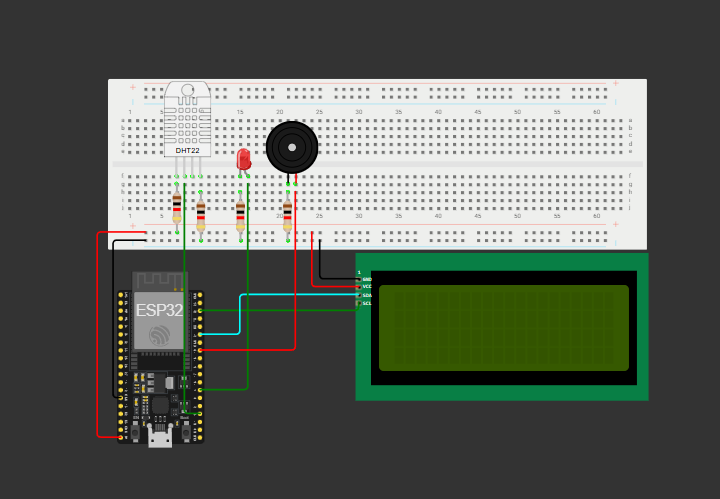
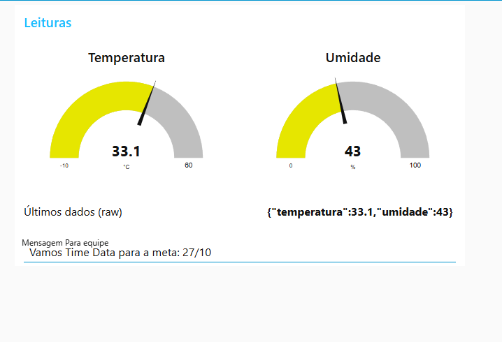
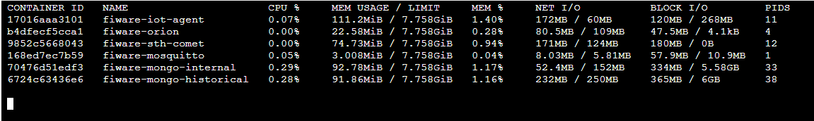

# GlobalSolution-IoT2S
Repositório que servirá para versionar o código em .ino para matéria de Edge Computing.

# Descrição do 🚫problema🚫
Atualmente a sociedade tem passado por um aumento nos casos de burnouts e doenças mentais. Segundo a ONU, quase 1 Bilhão de pessoas sofrem com ansiedade ou depressão, organização aponta que um dos motivos é a precarização do trabalho, com as pessoas em países menos desenvolvidos apresentando uma maior jornada de trabalho e em condições nada ideias. Fora isso, vale ressaltar o estudo sobre 'estresse térmico' da Escola de Higiene e Medicina Tropical Britânica, onde é apontado que 37°C em ambientes secos e sem ventos costumam ser mais desafiadores do que a mesma temperatura em ambientes umidos e com presença de ventos, com essa situação se extendendo para ambientes de trablaho.

# Nossa 🚀solução🚀
Quando se trata de Internet das Coisas e microcontroladores, nossa solução tenta amenizar os problemas mencionados anterirormente, ou seja, queremos um ambiente de trabalho mais adequado e colaborativo. Nossa proposta se divide em três partes principais: uma tela que recebe mensagens de um gerente ou líder de equipe, um conjunto de led e buzzer para avisar o funcionario de possíveis pausas e, para fechar, um sensor de temperatura e umidade para verificar se o ambiente está adequado para os funcionários atingirem seu potêncial máximo.

# Um olhar mais  💻 técnico 💻 
## Falando um pouco sobre as tecnologias utilizadas:
- Git e GitHub: Versionamento de código.
- ESP32: Captação e recebimento de dados.
- Node-Red: Uma melhor visualização da informação via dashboards.
- Microsoft Azure aliado ao fiware: Utilização no Broker MQTT mosquitto.
- Wokwi: Ferramenta para a construção da solução.

# Imagens

## Circuito 📟Completo📟

    

## Dashboard 🔴Node-Red🔴

    

## VM Azure com 🐋 Fiware🐋 

    

# Links

- Projeto Wokwi - Solução: [Clique aqui](https://wokwi.com/projects/447424608338817025)

- Video: [Clique aqui](preencher)

# Integrantes
* Enzo Amá Fatobene - RM: 562138
* João Victor Rodrigues de Mattos - RM: 564249
* Paulo Henrique Barboza de Oliveira Ramos - RM: 562179